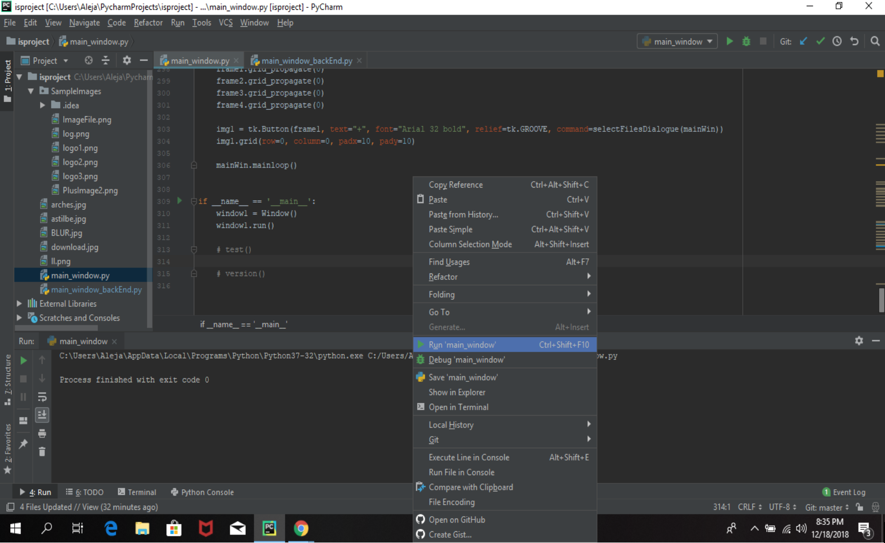
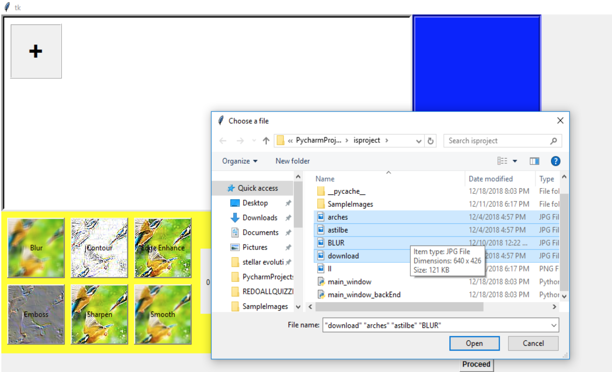
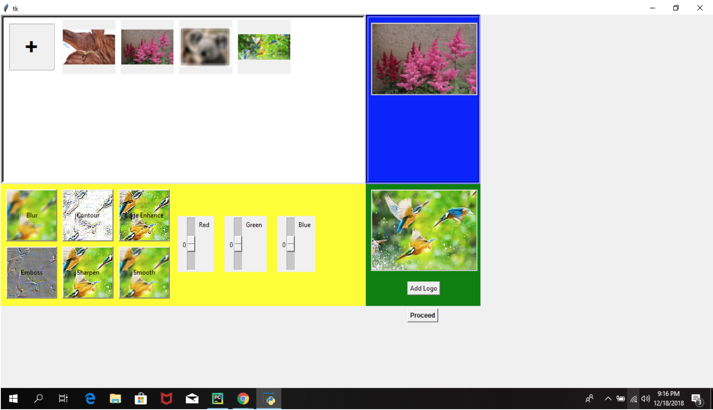
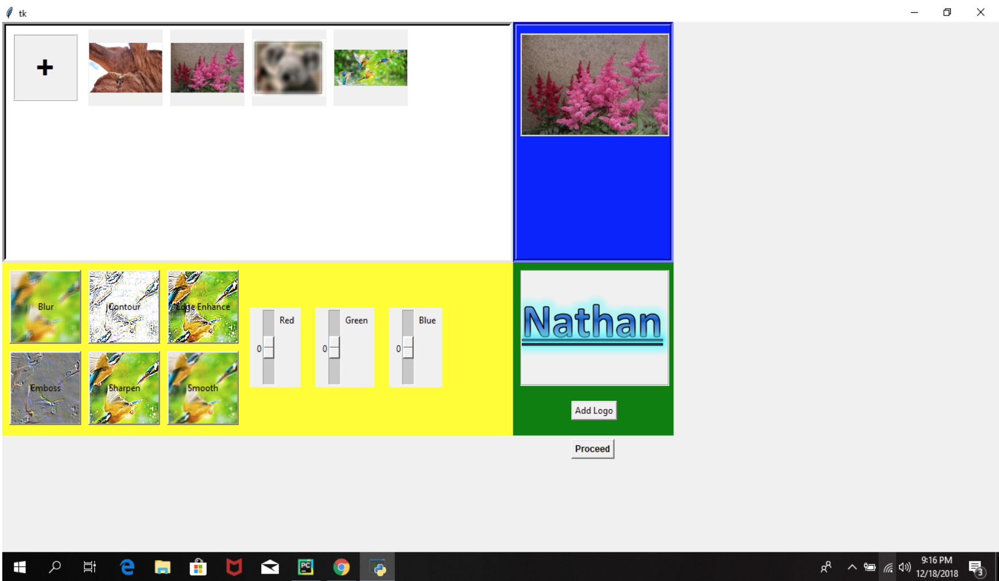
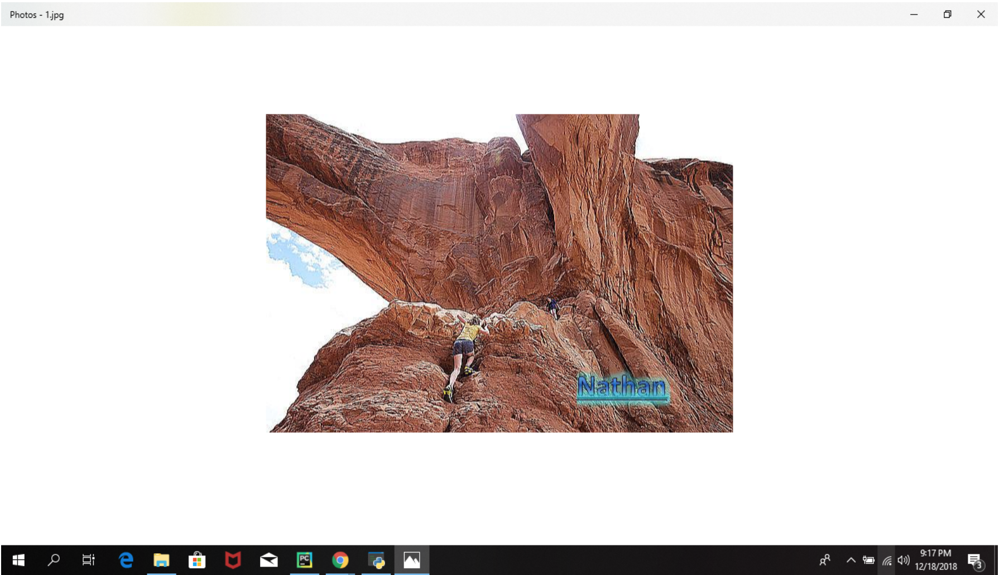
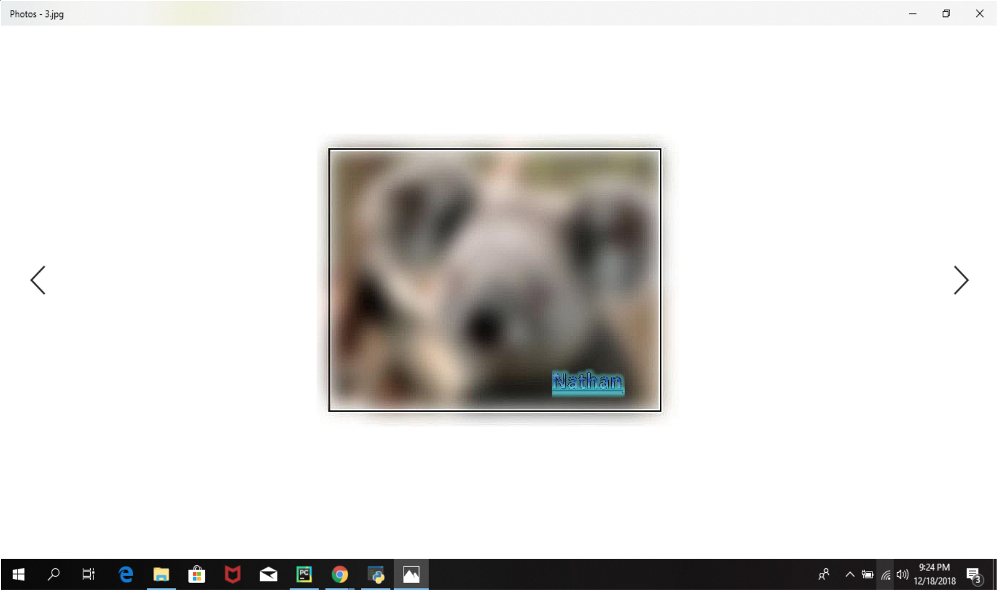

# Image Stamping Project
##### Author: Vichearith Meas, Ngo Nhat, Alejandro Aguilar

### Summary

Image Stamping Project,  abbreviated ISP, is designed to appeal the average consumer who has keen interest in the modification of images. This project is designed to help image enthusiasts with all types of experiences, professional or recreational, with the filtering process and even stamping their signature logo in selected images. ISP does this by providing the user with several dynamic filters such as Blur, Contour, Edge Enhance, Emboss, Sharpen and Smooth.

### Instructions

ISP can be launched via the use of a python interpreter known as Pycharm. Once the set of files containing the scripts are downloaded and opened as a python project, a set of images will be downloaded as well as the main python scripts main_window.py and main_window_backEnd.py. The images downloaded along with the main scripts are only there to get comfortable with the  testing the program. Once comfortable, the user starts the image manipulation process with his/her own photos.

Once downloaded,  the following step is to get ISP up and running. To do this, the user must run the main_window.py file. Once this file runs, a GUI window will pop up, displaying Frame 2. Once this frame runs, you will encounter several boxes each displaying different types of information. The box located in the top left corner, if clicked, will allow the user to access his/her files and search for a set of images he/she wants to be processes with ISP.

These images will be displayed alongside the original top left box. If these images are clicked, then in the blue section of frame 2 will a thumbnail of this image be displayed. This thumbnail is dynamic and will change depending on which Image is being selected. 

Next, the user can choose to add a filter to the images being selected by clicking the buttons in the yellow section of frame two. These filters are not visible in the thumbnail picture, but rest assure your photos are being changed. Now, the main purpose of ISP, the stamping.

After the set of images are selected and filter is applied, the user can click on the add logo button in the green section of frame 2. This will pop up the user’s files, allowing the user to select a logo he or she wishes to implement in all the chosen pictures. This logo will be immediately displayed, reassuring the user that its logo chosen is the correct one.

After all of this is done, the user must then click on the proceed button. Another pop-up window will appear. This pop-up window enables the user to save his/her processed images in a file of his/her choosing.

---
###Contents of the Program:

The directory contains two important files: `main_window.py`  script and `main_window_backEnd.py` script. The organization of our project is simple yet efficient. The `main_window.py` script contains the bulk of our code. This script contains the GUI interface code, all the code for the widgets to be formed, and contains the code that links all the helper functions with their corresponding widget. The `main_window_backEnd.py` script is the one that makes image manipulation possible. Located in this script are all the helper functions such as `createThumbnail`, which creates a copy of the selected images by manipulating them, the `selecFilesDialogue` function which allows the user to select the pictures he/she wants to manipulate from her computer, the StampForReal function that stamps the photo and returns the new picture created through image manipulation.

We are confident that the widgets and our functions works because we are able to select them accordingly and perform the function we want them to do. We tested these functions through trial and error, making sure the desired result was achieved for ISP.

###Conclusion:

This project was a test of patience. It really helped us, as aspiring computer scientists, learn what it takes to tackle a problem head on and seek solutions to it. It helped us understand the meaning of teamwork, and most importantly communication. A big part of this project was communication, or lack thereof at times. Without the right communication, it was difficult to make progress because two or more people would be working on a single issue without knowing of it, limiting our potential. That being said, we were successful in the implementation of our project. Although the end goal aspired was met, the way it was done so was not what we wanted. We wanted a program that would look neat, work smoothly, and displaying real life changes in the created thumbnail, including RGB color manipulation from scroll bars, filters, and different pictures. Although this goal was ultimately met, we realized that these changes could not be displayed in real time on the GUI because the GUI uses a photoImage object to display the thumbnail as a frame, but the image manipulation occurs using only an Image type. Furthermore,  we had also hoped to use more filters in the end result, but since we couldn't get a scroll-bar widget to work, we decided to do away with it. If we have had more time, we would implement more filters, try to find a solution to display dynamic changes in real time in the GUI, make a working scroll bar and ultimately make the frame look neater and smoother. 
